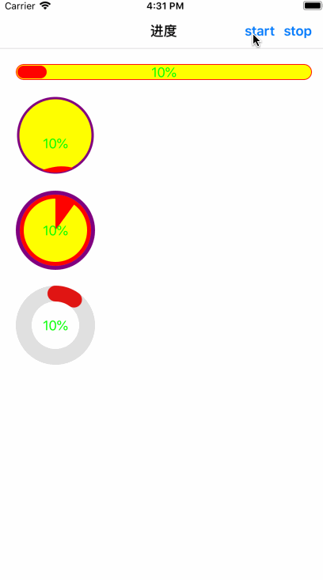

# SYProgressView
SYProgressView show the progress while change value.

四种类型的进度视图
1、条形进度
2、环形进度
3、饼形进度
4、水波纹进度

# 效果图




# 使用介绍
* 自动导入：使用命令pod 'SYProgressWebView' 导入到项目中
* 手动导入：或下载源码后，将源码添加到项目中

# 代码示例

```
// 导入头文件
#import "SYLineProgressView.h"

// 实例化
self.lineProgress = [[SYLineProgressView alloc] initWithFrame:CGRectMake(20.0, 20.0, (self.view.frame.size.width - 40.0), 20)];
[self.view addSubview:self.lineProgress];

// 属性设置
self.lineProgress.layer.cornerRadius = 10;
self.lineProgress.lineWidth = 1.0;
self.lineProgress.lineColor = [UIColor redColor];
self.lineProgress.progressColor = [UIColor redColor];
self.lineProgress.defaultColor = [UIColor yellowColor];
self.lineProgress.label.textColor = [UIColor greenColor];
self.lineProgress.label.hidden = NO;

// 初始化
[self.lineProgress initializeProgress];

// 设置进度
self.lineProgress.progress = self.progress;
```

```
// 导入头文件
#import "SYWaveProgressView.h"

// 实例化
self.waveProgress = [[SYWaveProgressView alloc] initWithFrame:CGRectMake(20.0, 20.0, (self.view.frame.size.width - 40.0), 20)];
[self.view addSubview:self.waveProgress];

// 属性设置
self.waveProgress.lineColor = [UIColor purpleColor];
self.waveProgress.lineWidth = 3.0;
self.waveProgress.progressColor = [UIColor redColor];
self.waveProgress.defaultColor = [UIColor yellowColor];
self.waveProgress.label.textColor = [UIColor greenColor];
self.waveProgress.label.hidden = NO;
self.waveProgress.showBorderline = YES;

// 初始化
[self.waveProgress initializeProgress];

// 设置进度
self.waveProgress.progress = self.progress;
```

```
// 导入头文件
#import "SYPieProgressView.h"

// 实例化
self.pieProgress = [[SYPieProgressView alloc] initWithFrame:CGRectMake(20.0, 20.0, (self.view.frame.size.width - 40.0), 20)];
[self.view addSubview:self.pieProgress];

// 属性设置
self.pieProgress.lineColor = [UIColor purpleColor];
self.pieProgress.lineWidth = 5.0;
self.pieProgress.progressColor = [UIColor redColor];
self.pieProgress.defaultColor = [UIColor yellowColor];
self.pieProgress.label.textColor = [UIColor greenColor];
self.pieProgress.label.hidden = NO;
self.pieProgress.showBorderline = YES;

// 初始化
[self.pieProgress initializeProgress];

// 设置进度
self.pieProgress.progress = self.progress;
```

```
// 导入头文件
#import "SYRingProgressView.h"

// 实例化
self.ringProgress = [[SYRingProgressView alloc] initWithFrame:CGRectMake(20.0, 20.0, (self.view.frame.size.width - 40.0), 20)];
[self.view addSubview:self.ringProgress];

// 属性设置
self.ringProgress.lineColor = [UIColor colorWithWhite:0.4 alpha:0.2];
self.ringProgress.lineWidth = 20.0;
self.ringProgress.progressColor = [UIColor redColor];
self.ringProgress.defaultColor = [UIColor yellowColor];
self.ringProgress.label.textColor = [UIColor greenColor];
self.ringProgress.label.hidden = NO;

// 初始化
[self.ringProgress initializeProgress];

// 设置进度
self.ringProgress.progress = self.progress;
```


# 修改完善
* 20181116
  * 版本号：1.0.1
  * 新增数值变化的动画效果
    * 新增UILabel子类 SYAnimationLabel
    * 新增属性 animationText

* 20181115
  * 版本号：1.0.0
  * 新增源码

